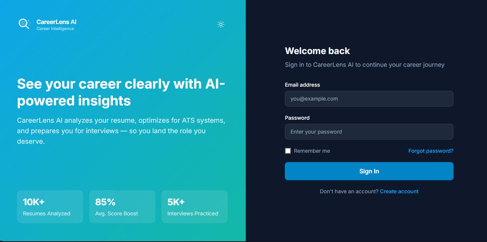
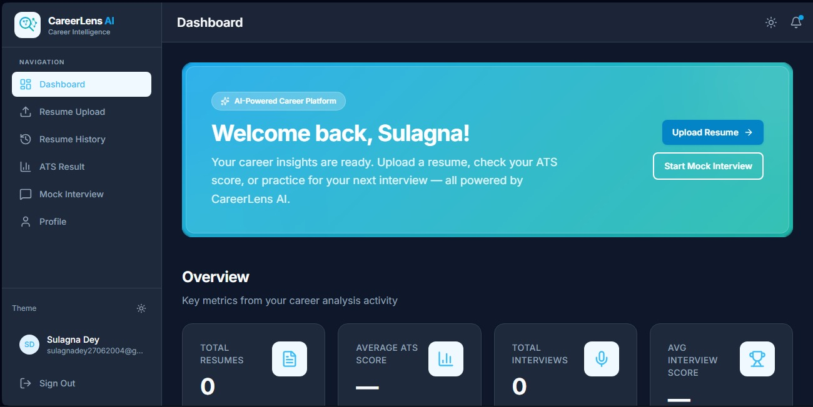
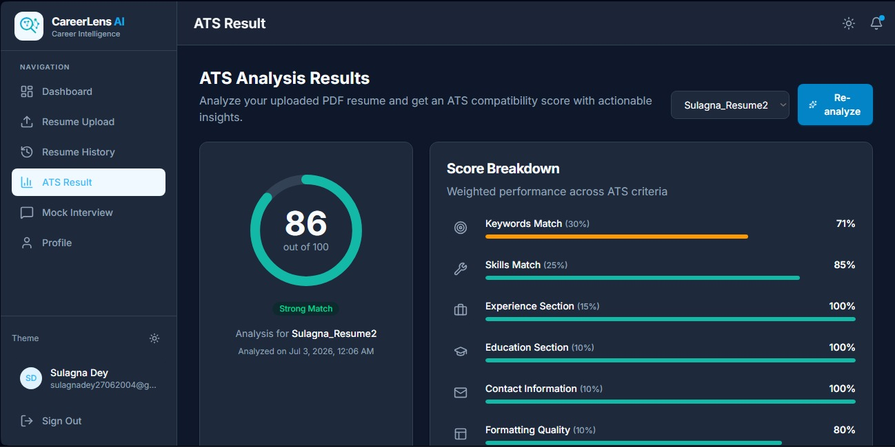
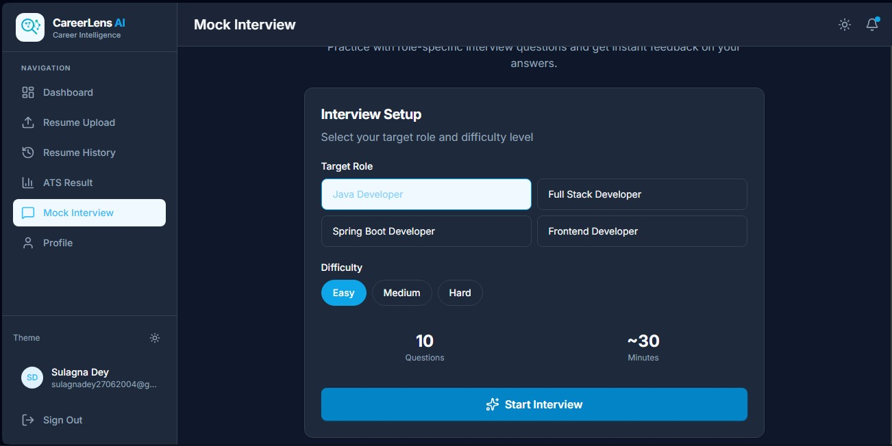

# 🚀 CareerLens AI

An AI-powered Resume Analyzer & Mock Interview Platform that helps students and job seekers improve their resumes, prepare for interviews, and receive AI-driven career guidance.


---

## 📌 Overview

CareerLens AI is a full-stack web application that combines Artificial Intelligence with career guidance.

The platform allows users to:

- 📄 Analyze resumes using AI
- 🎤 Practice mock interviews
- 💼 Get career recommendations
- 📈 Improve ATS Resume Score
- 🤖 Receive personalized AI feedback

---

# ✨ Features

### 👤 User Module

- User Registration
- Secure Login & Authentication
- Resume Upload
- Resume ATS Analysis
- AI Career Suggestions
- Mock Interview Practice
- Performance Dashboard
- Profile Management

---

### 👨‍💼 Admin Module

- Admin Login
- Manage Users
- Manage Interview Questions
- Dashboard Analytics
- View Uploaded Resumes
- Manage AI Reports

---

### 🤖 AI Module

- Resume Analysis
- ATS Score Generation
- Career Recommendation
- Skill Gap Analysis
- AI Feedback
- Interview Evaluation

---

# 🏗️ Project Architecture

```
CareerLens-AI
│
├── frontend/
│     React Application
│
├── java-backend/
│     Spring Boot REST APIs
│
├── python-ai-service/
│     FastAPI AI Services
│
└── MySQL Database
```

---

# 🛠️ Tech Stack

## Frontend

- React
- HTML5
- CSS3
- JavaScript
- Bootstrap

## Backend

- Java
- Spring Boot
- Spring Security
- JWT Authentication
- Maven

## AI Service

- Python
- FastAPI
- Machine Learning

## Database

- MySQL

---

# 📂 Folder Structure

```
frontend/
java-backend/
python-ai-service/
README.md
PROJECT_REQUIREMENTS.md
```

---

# ⚙️ Installation

## Clone Repository

```bash
git clone https://github.com/yourusername/careerlens-ai.git
```

---

## Frontend

```bash
cd frontend

npm install

npm run dev
```

---

## Spring Boot Backend

```bash
cd java-backend

mvn spring-boot:run
```

---

## FastAPI AI Service

```bash
cd python-ai-service

pip install -r requirements.txt

uvicorn main:app --reload
```

---

## Database

Create MySQL Database

```
careerlens
```

Update your MySQL username and password inside

```
application.properties
```

---

# 📸 Screenshots

## Home Page



## Dashboard



## Resume Analysis



## Mock Interview



---

# 🚀 Future Improvements

- AI Resume Builder
- Company-wise Interview Questions
- AI Chat Assistant
- Voice Interview
- Job Recommendation System
- Resume PDF Generator

---

# 🤝 Contributors

This project was developed collaboratively.

## Team Members

| Name | Role |
|------|------|
| **Sulagna Dey** | Full Stack Developer |
| **Rohit Sil** | Frontend Developer |

---

## Individual Contributions

### Sulagna Dey

- Spring Boot Backend Development
- REST API Development
- Database Design
- Authentication & Authorization
- GitHub Repository Management

### Rohit Sil

- React Frontend
- UI Design
- Dashboard
- FastAPI
- AI Resume Analysis
- Machine Learning

---

# 📄 License

This project is developed for educational and placement purposes.
